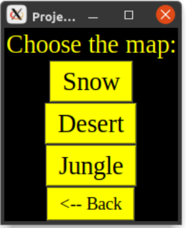
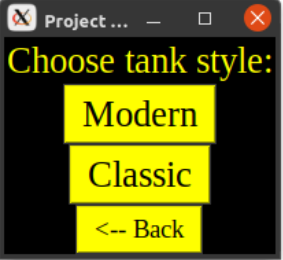
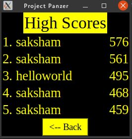
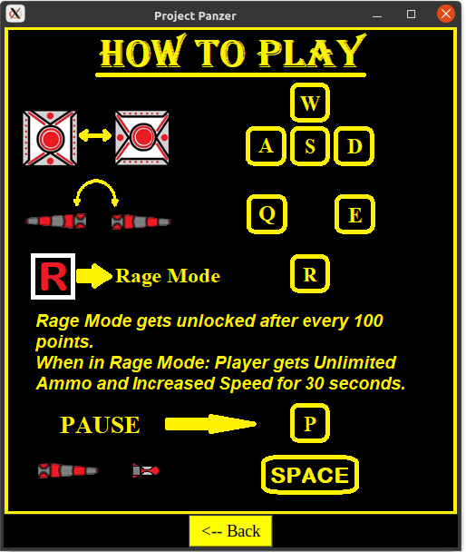
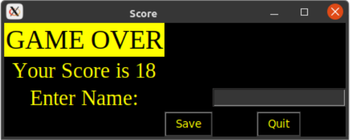

# panzer

A 2D game built using pyglet and Python 3

## About

Panzer is a small arcade-inspired game in which the player controls a tank which has to
defend a vulnerable base from enemy attack from all fronts. The player tank can collide with
enemy tanks to destroy them or shoot at them using the gun. If the enemy tanks reach the
base, they will drain health from it until the base is fully finished.. Stop this from happening with
quick reflexes and a powerful “Rage Mode” which can trigger on getting 100 points or more
and various powerups. In Rage Mode enemies become bigger but player gets unlimited ammo
for 30 seconds. MySQL database is used to keep a track of the player points and generate the
leaderboard. A variety of artwork and sound effects are used with the powerful Pyglet module
in order to render all of this.

This program consists of several options:

a. Play the game in 3 maps: Snow, Desert, and Jungle



b. Play the game using 2 different types of tanks (only superficial differences
between the two): Modern and classic



c. View high scores



d. View controls



e. Pause the game at any time

f. Enter your name when the game ends to save your score



## Requirements

Panzer uses MySQL to keep track of game scores, so you must have it running as localhost on your system.

Required modules include:

- pyglet: used to render the game
- mysql.connector: used to connect to MySQL to create database and record scores, etc.
- pillow: used to show pictures in certain areas

The game is written in Python, and all the modules used are cross-platform. The game has been tested to work in Windows 10, macOS, and Linux.

## Usage

To run the game, run

```$ python homepage.py
```

## Debugging

Debugging is done by editing assets/resources.py file and changing the value of the ```DEBUG``` variable.

If it is true, debugging mode is turned on. When you play the game, 

- There will be console output which can be easily saved to a file for later perusal

- Activating ragemode will take much less points
